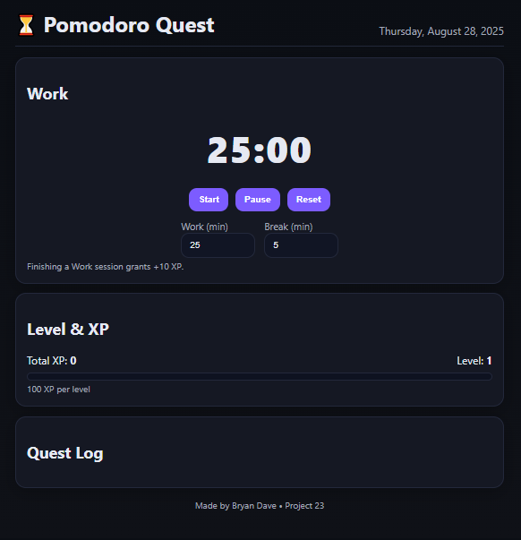

⏳ Pomodoro Quest Timer

A gamified Pomodoro timer that helps you focus on work sessions and take breaks like completing RPG quests. Each completed Work session grants +10 XP and contributes to your level progress.

🌐 Live Demo

👉 [https://codepen.io/Bryan-Dave-Hernandez/pen/zxvaWrx?editors=1010]

✨ Features

Start / Pause / Reset – control your timer easily

Custom Work & Break lengths – adjust session durations (default 25/5)

XP & Level System – +10 XP for every Work session, Level Up every 100 XP

Quest Log – see your last 6 sessions with timestamps

Local Storage – progress and logs saved even after refresh

# 🖼️ Screenshot

📖 Project Overview

This is Project 23 in my Zero-to-Hero coding journey.
It’s a combination of productivity and RPG mechanics: work becomes a quest, breaks become recovery, and XP makes it fun to keep going.

🛠️ Built With

HTML – structure of the timer and interface

CSS – styling with RPG card-like design and XP bar

JavaScript – logic for timer, XP system, and saving logs

🚀 How to Run

Clone or download the repo

Open index.html in your browser

Adjust Work/Break minutes as needed

Start timer and earn XP for every completed session!
